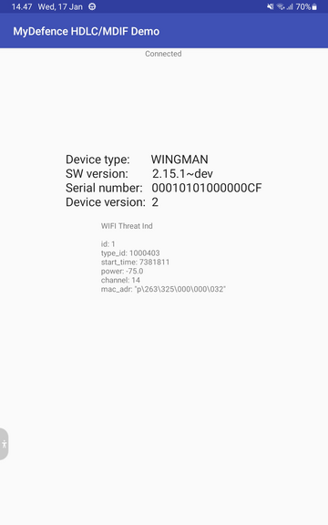

 <!-- **************************************************************************
 *                                                                             *
 *                                                 ,,                          *
 *                                                       ,,,,,                 *
 *                                                           ,,,,,             *
 *           ,,,,,,,,,,,,,,,,,,,,,,,,,,,,                        ,,,,          *
 *          ,,,,,,,,,,,,,,,,,,,,,,,,,,,,,            ,,,,          ,,,,        *
 *          ,,,,,       ,,,,,      ,,,,,,                ,,,,        ,,,       *
 *          ,,,,,       ,,,,,      ,,,,,,                   ,,,        ,,,     *
 *          ,,,,,       ,,,,,      ,,,,,,       ,,,           ,,,        ,     *
 *          ,,,,,       ,,,,,      ,,,,,,           ,,,         ,,        ,    *
 *          ,,,,,       ,,,,,      ,,,,,,              ,,        ,,            *
 *          ,,,,,       ,,,,,      ,,,,,,                ,        ,            *
 *          ,,,,,       ,,,,,      ,,,,,,                 ,                    *
 *          ,,,,,       ,,,,,      ,,,,,,                                      *
 *          ,,,,,       ,,,,,      ,,,,,,                                      *
 *                                       ,,,,,,,,,,,,,,,,,,,,,,,,,,            *
 *                                       ,,,,,,,,,,,,,,,,,,,,,,,,,,,,          *
 *                                       ,,,,,                  ,,,,,,         *
 *                     ,                 ,,,,,                  ,,,,,,         *
 *             ,        ,,               ,,,,,                  ,,,,,,         *
 *    ,        ,,        ,,,             ,,,,,                  ,,,,,,         *
 *     ,        ,,,         ,,,          ,,,,,                  ,,,,,,         *
 *     ,,,       ,,,                     ,,,,,                  ,,,,,,         *
 *      ,,,        ,,,,                  ,,,,,                  ,,,,,,         *
 *        ,,,         ,,,,               ,,,,,                  ,,,,,,         *
 *         ,,,,,            ,,,,         ,,,,,,,,,,,,,,,,,,,,,,,,,,,,          *
 *            ,,,,                       ,,,,,,,,,,,,,,,,,,,,,,,,,,            *
 *               ,,,,,                                                         *
 *                    ,,,,,                                                    *
 *                                                                             *
 * Program/file : README.md                                                    *
 *                                                                             *
 * Description  : readme file with information on how to install tools and     *
 *              : build the Android demo application.                          *
 *                                                                             *
 * Copyright 2023 MyDefence A/S.                                               *
 *                                                                             *
 * Licensed under the Apache License, Version 2.0 (the "License");             *
 * you may not use this file except in compliance with the License.            *
 * You may obtain a copy of the License at                                     *
 *                                                                             *
 * http://www.apache.org/licenses/LICENSE-2.0                                  *
 *                                                                             *
 * Unless required by applicable law or agreed to in writing, software         *
 * distributed under the License is distributed on an "AS IS" BASIS,           *
 * WITHOUT WARRANTIES OR CONDITIONS OF ANY KIND, either express or implied.    *
 * See the License for the specific language governing permissions and         *
 * limitations under the License.                                              *
 *                                                                             *
 *                                                                             *
 *                                                                             *
 *************************************************************************** -->

## MDIF Android Demo Application

This Android project demonstrates the implementation of MyDefence HDLC and MDIF
in Android.

This project is created using the Android NDK samples
project [Hello JNI Callback](https://github.com/android/ndk-samples/tree/main/hello-jniCallback)
as template.

## Installing

You need to install docker and make. For docker use the OS package manager or
the convenience script provided at [get.docker.com](https://get.docker.com/).

Docker is used to create a container with the necessary tools to compile the
MDIF .proto files into Java source files.

Install Docker as mentioned above and on Ubuntu make is installed with:

    sudo apt install make

Enter directory *src/android_demo* and generate Java source files from .proto

    make pb

### Getting Started with Android Studio

Android Studio installation follows same procedure as described in
[Hello JNI Callback](https://github.com/android/ndk-samples/tree/main/hello-jniCallback)

1. [Download Android Studio](http://developer.android.com/sdk/index.html)
1. Launch Android Studio.
1. Open *src/android_demo* directory.
1. Click *Tools/Android/Sync Project with Gradle Files*.
1. Click *Run/Run 'app'*.

### Running from command line

Alternatively you are able to build the apk using command line. This does, however, require
that Android SDK is available.

Open *src/android_demo* directory and then

    make android_demo

## Screenshots

